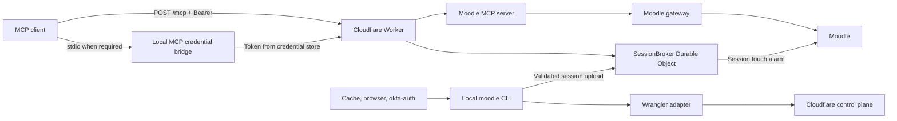

# Moodle CLI v0.7.0: MCP and Cloudflare Workers Release Plan

**Status:** Approved design baseline

**Target release:** `0.7.0`

**Implementation preview:** `0.7.0-alpha.7`

**Primary install path:** `npm install -g moodle-cli`

**Primary onboarding command:** `moodle mcp deploy`

**MCP protocol:** `2026-07-28`, with stateless legacy compatibility for `2025-11-25`

## 1. Release Outcome

Version `0.7.0` will ship a managed Moodle MCP product with five parts:

1. A local stdio MCP server.
2. A private Cloudflare Worker MCP server.
3. Bearer-token authentication.
4. Encrypted Moodle session storage with remote keepalive.
5. A local renewal bridge that obtains replacement Moodle cookies from the browser or `okta-auth`.

A user with an active Moodle browser session should reach a working remote MCP server with:

```bash
npm install -g moodle-cli
moodle mcp deploy
```

The user should not copy a Moodle cookie, create Cloudflare secrets, edit Wrangler configuration, or paste a Bearer token into client settings.

## 2. Product Contract

### Primary commands

```bash
moodle mcp deploy
moodle mcp status
moodle mcp login
moodle mcp connect
moodle mcp remove
```

### Command behavior

| Command | Contract |
|---|---|
| `moodle mcp deploy` | Acquire a Moodle session, deploy or update the Worker, upload the session, install renewal, run smoke tests, and connect detected MCP clients |
| `moodle mcp status` | Report local authentication, Worker health, Moodle readiness, renewal status, protocol support, and client configuration |
| `moodle mcp login` | Obtain a fresh Moodle session and push it to the deployed Worker |
| `moodle mcp connect` | Configure detected MCP clients through a local credential bridge or native remote MCP |
| `moodle mcp remove` | Remove the Worker, local renewal job, client registrations, and local deployment credentials after confirmation |

Advanced operations remain available as flags:

```bash
moodle mcp deploy --dry-run
moodle mcp deploy --repair
moodle mcp deploy --rotate-token
moodle mcp deploy --rollback
moodle mcp status --verbose
moodle mcp status --logs
```

The default help output should keep the five primary commands visible and place recovery flags under the relevant command help.

## 3. First-Run Onboarding

### 3.1 Setup introduction

Interactive deployment starts with:

```text
Moodle MCP setup

This command will:
  • verify your Moodle sign-in
  • deploy a private MCP server to your Cloudflare account
  • install session renewal on this computer
  • connect supported MCP clients

Your Moodle password and session cookie will not be printed or stored in this project.

Continue? [Y/n]
```

`--yes` accepts the defaults and suppresses this confirmation.

### 3.2 Moodle site selection

If the CLI already has a configured site:

```text
Moodle site: https://lms.example.edu
```

If the CLI finds several profiles:

```text
Choose a Moodle site:

  1. Monash University
     https://lms.monash.edu

  2. Test Moodle
     https://moodle.example.net

Selection:
```

If no site exists:

```text
Enter the Moodle site root URL.

Example: https://lms.example.edu
Do not include /login, /my, or another page path.

Moodle site:
```

### 3.3 Local session acquisition

The CLI checks sources in this order:

1. Current session cache.
2. Browser cookies.
3. Stored `okta-auth` cookies.
4. Interactive browser sign-in.

Valid cached session:

```text
✓ Found a valid Moodle session.
  User: Alice Example
  Site: Monash University
```

Valid browser session:

```text
✓ Imported your active Moodle browser session.
  Browser: Chrome
  User: Alice Example
```

No valid session:

```text
No active Moodle session was found.

I can open the Moodle sign-in page in your browser. Complete your normal sign-in, including MFA. This terminal will wait for Moodle to finish the login.

Open the browser now? [Y/n]
```

While waiting:

```text
Waiting for Moodle sign-in...
You may return to this terminal after the Moodle dashboard appears.
```

Success:

```text
✓ Moodle sign-in completed.
✓ Session verified against https://lms.example.edu.
```

Timeout:

```text
Moodle sign-in did not finish within 2 minutes.

The browser window can remain open. Complete the sign-in, then run:

  moodle mcp login
```

Non-interactive failure:

```text
Moodle sign-in requires user input.

Run this command in an interactive terminal:

  moodle mcp login

Then repeat:

  moodle mcp deploy --yes
```

The CLI cannot manufacture a valid Moodle cookie. Moodle or the configured identity provider must issue one. The CLI hides cookie extraction, validation, upload, and rotation from the user.

### 3.4 Cloudflare authentication

Existing Wrangler session:

```text
✓ Cloudflare account detected.
  Account: Personal
  Account ID: 0123456789abcdef
```

No Wrangler session:

```text
Cloudflare sign-in is required.

Wrangler will open Cloudflare's authorization page. moodle-cli will not receive your Cloudflare password.

Continue to Cloudflare? [Y/n]
```

Several accounts:

```text
Choose the Cloudflare account for this MCP server:

  1. Personal
     0123456789abcdef

  2. TuuHub
     fedcba9876543210

Selection:
```

The CLI stores the selected account ID as non-secret deployment state.

### 3.5 Deployment defaults

The CLI derives a Worker name from the Moodle hostname:

```text
Worker name: moodle-lms-example-edu-mcp
Region: Cloudflare global network
MCP access: private Bearer token
Moodle access: read-only
```

A name collision presents an explicit choice:

```text
A Worker named moodle-lms-example-edu-mcp already exists.

  1. Update the existing Moodle MCP deployment
  2. Choose another Worker name
  3. Cancel

Selection:
```

### 3.6 Credential explanation

Before first deployment:

```text
Moodle MCP will create two private credentials:

  MCP access token
  Allows MCP clients to read data exposed by this server.

  Session sync token
  Allows this computer to replace the Worker's Moodle session.

The credentials will be stored in your operating system credential store. They will not appear in Wrangler arguments, logs, or project files.
```

Storage order:

| Platform | Preferred store | Fallback |
|---|---|---|
| macOS | Login Keychain | File with `0600` permissions |
| Linux | Secret Service | File with `0600` permissions |
| Windows | Credential Manager | User-protected credential file |

### 3.7 Deployment progress

The interactive command displays stable stages:

```text
[1/8] Validating Moodle session
[2/8] Checking Cloudflare access
[3/8] Preparing Worker release
[4/8] Uploading private credentials
[5/8] Deploying candidate version
[6/8] Uploading Moodle session
[7/8] Running MCP and Moodle checks
[8/8] Installing renewal and client connection
```

Each completed stage replaces its line with a checkmark. JSON mode emits structured events with the same stage IDs.

### 3.8 Successful deployment

```text
Moodle MCP is ready.

Endpoint
  https://moodle-lms-example-edu-mcp.example.workers.dev/mcp

Protocol
  MCP 2026-07-28
  Stateless legacy compatibility: 2025-11-25

Moodle
  Site: https://lms.example.edu
  User: Alice Example
  Session: ready

Renewal
  Installed on this computer
  Next check: within 30 minutes

Connected clients
  ✓ Codex
  ✓ Claude Desktop

Run `moodle mcp status` at any time.
```

The CLI does not print the raw MCP token. Users can request an explicit one-time reveal:

```bash
moodle mcp connect --show-token
```

That command requires confirmation and writes the token to the TTY only.

## 4. Recovery and Failure Copy

### Moodle session expired

Background status:

```text
Moodle MCP needs sign-in.

The remote server is running, but Moodle rejected its session.

Run:

  moodle mcp login
```

macOS, Linux, and Windows notification:

```text
Title: Moodle MCP needs sign-in
Body: Your Moodle session expired. Run `moodle mcp login` to restore remote access.
```

Recovery success:

```text
✓ New Moodle session acquired.
✓ Remote session updated.
✓ MCP readiness restored.
```

### Moodle unavailable

```text
Moodle MCP cannot reach https://lms.example.edu.

The current session has been preserved. No login is required yet.

Try again with:

  moodle mcp status
```

The CLI must distinguish network failures from authentication failures.

### Candidate deployment failed

```text
Cloudflare accepted the candidate Worker, but the release failed validation.

Production traffic was not changed.

Failed check:
  server/discover returned an unsupported response

Run `moodle mcp status --verbose` for the sanitized diagnostic report.
```

### Production verification failed

```text
The new release failed its production check.

moodle-cli restored the previous healthy release with the current credentials and Moodle session.

Current status: ready
```

### Cloudflare authorization expired

```text
Cloudflare authorization has expired.

Run:

  moodle mcp deploy --repair

Wrangler will request Cloudflare authorization again.
```

### Client configuration failed

```text
The MCP server is ready, but Codex configuration could not be updated.

No existing client configuration was overwritten.

Run:

  moodle mcp connect codex
```

## 5. Status Model and Health Endpoints

The Worker will use common probe paths:

```text
GET /healthz
GET /readyz
```

### `/healthz`

Purpose: Worker liveness.

- Public endpoint.
- No Moodle request.
- No account, hostname, or session details.
- Response type: `application/health+json`.

```json
{
  "status": "pass",
  "serviceId": "moodle-mcp",
  "version": "0.7.0"
}
```

### `/readyz`

Purpose: Moodle and session readiness.

- Requires the session-management Bearer token.
- Uses the Health Check Response Format conventions.
- Returns `200` for `pass` and `warn`.
- Returns `503` for `fail`.

```json
{
  "status": "pass",
  "serviceId": "moodle-mcp",
  "version": "0.7.0",
  "checks": {
    "moodle:session": [
      {
        "status": "pass",
        "code": "SESSION_VALID",
        "time": "2026-08-09T06:00:00Z"
      }
    ],
    "moodle:upstream": [
      {
        "status": "pass",
        "code": "MOODLE_REACHABLE"
      }
    ]
  }
}
```

### Stable reason codes

```text
SESSION_VALID
SESSION_EXPIRING
SESSION_MISSING
SESSION_EXPIRED
SESSION_SYNC_STALE
MOODLE_REACHABLE
MOODLE_UNREACHABLE
RENEWAL_AGENT_MISSING
RENEWAL_AGENT_STALE
```

Top-level health status:

| Status | HTTP | Meaning |
|---|---:|---|
| `pass` | 200 | The Worker can serve Moodle MCP requests |
| `warn` | 200 | The service still works and needs attention |
| `fail` | 503 | The service cannot complete Moodle MCP requests |

Session actions such as `kept_alive` and `reauthenticated` belong in an event history. They do not belong in the current-state enum.

HTTP errors outside health probes use RFC 9457 Problem Details.

## 6. Runtime Architecture



### `MoodleGateway`

The team will separate Moodle HTTP and parsing logic from Node authentication code.

```ts
interface MoodleGateway {
  getUser(): Promise<UserInfo>;
  getOverview(input: OverviewInput): Promise<Overview>;
  listCourses(): Promise<Course[]>;
  getCourse(input: CourseInput): Promise<CourseDetail>;
  listActivities(input: ActivityListInput): Promise<Activity[]>;
  getActivity(input: ActivityInput): Promise<ActivityDetail>;
  getGrades(input: GradeInput): Promise<CourseGrades>;
  listForums(input: ForumListInput): Promise<Forum[]>;
  searchForums(input: ForumSearchInput): Promise<ForumSearchResult[]>;
  getThread(input: ThreadInput): Promise<ForumThread>;
}
```

The Worker bundle must not import `sweet-cookie`, `node:fs`, `node:child_process`, or browser profile code.

### `MoodleMcpServer`

This module owns:

- Tool registration and deterministic order.
- Input and output schemas.
- MCP result metadata.
- Moodle error translation.
- Modern and legacy transport adapters.

### `SessionBroker`

A SQLite-backed Durable Object owns one Moodle session per deployment.

Stored fields:

```text
encrypted_cookie
cookie_name
revision
sesskey
moodle_user_id
last_verified_at
last_touch_at
last_error_code
next_alarm_at
```

The Durable Object stores AES-GCM ciphertext. A Worker Secret supplies the encryption key.

Session updates use compare-and-swap revision checks. A stale computer receives `409 SESSION_REVISION_CONFLICT` and cannot overwrite a newer session.

### `ManagedMcpDeployment`

This module owns the release transaction:

```ts
interface ManagedMcpDeployment {
  plan(intent: DeploymentIntent): Promise<DeploymentPlan>;
  apply(plan: DeploymentPlan): AsyncIterable<DeploymentEvent>;
  inspect(profile: string): Promise<DeploymentStatus>;
  recover(profile: string): Promise<RecoveryResult>;
  remove(profile: string): Promise<RemovalResult>;
}
```

The command tree and tests use the same interface.

## 7. MCP Protocol Surface

### Transport

- Native MCP `2026-07-28`.
- Streamable HTTP at `POST /mcp`.
- Local stdio through `moodle mcp serve --stdio`.
- Stateless compatibility for `2025-11-25`.
- `GET /mcp` returns `405`.
- The server implements `server/discover`.
- The server validates request `_meta` against HTTP metadata headers.
- The server rejects unsupported versions with `UnsupportedProtocolVersionError`.

### Tools

Version `0.7.0` exposes these read-only tools:

```text
get_user
get_overview
list_courses
get_course
list_activities
get_activity
get_grades
list_forums
search_forums
get_thread
get_file
```

Tool requirements:

- Stable names and ordering.
- Zod input validation.
- Concise text content.
- Typed `structuredContent`.
- `resultType: "complete"`.
- `cacheScope: "private"`.
- Read-only annotations.
- Bounded list sizes.
- Embedded file resources bounded to 16 MiB.
- Stable Moodle error codes.

`get_file` accepts a positive resource activity ID, a same-site resource URL, or a same-site `pluginfile.php` URL. It returns concise metadata in `structuredContent` and the authenticated file bytes in an MCP embedded resource. Moodle cookies, sesskeys, and credential-bearing URL parameters never appear in the result.

Version `0.7.0` will not advertise prompts, resources, subscriptions, tasks, Roots, Sampling, or MCP Logging.

## 8. Bearer Authentication

The release uses two generated 256-bit credentials.

| Credential | Permission |
|---|---|
| MCP access token | Call `POST /mcp` and use read-only Moodle tools |
| Session sync token | Read `/readyz` and replace the encrypted Moodle session |

Security rules:

- The local credential store keeps the raw values.
- Worker Secrets contain token digests.
- The Worker compares digests with constant-time Web Crypto operations.
- The server rejects query-string tokens.
- Authentication runs before JSON body parsing.
- `401` responses include `WWW-Authenticate: Bearer`.
- Logs and errors exclude authorization headers.
- Token rotation uses a two-token overlap window.

The product will describe this mode as pre-shared Bearer authentication. A later OAuth release can replace the `RequestAuthorizer` adapter without changing tools or session storage.

## 9. Cookie Acquisition and Renewal

### Initial acquisition

`moodle mcp deploy` uses the existing local authentication chain:

```text
session cache
browser cookies
stored okta-auth cookies
interactive browser login
```

The CLI validates the selected cookie against the configured Moodle origin before deployment.

An advanced recovery path may accept a cookie over stdin:

```bash
moodle mcp session push --stdin
```

The CLI will not accept a cookie as a command argument.

### Worker keepalive

The Durable Object alarm calls Moodle’s session-touch endpoint and records the remaining server time.

The alarm:

- Schedules the next check from the reported session lifetime.
- Uses backoff after network failures.
- Preserves the current cookie after upstream failures.
- Captures Moodle cookie rotation.
- Avoids Cloudflare Cron Trigger capacity.

### Local renewal authority

The local renewal job queries `/readyz`, searches for a replacement session, validates it, and uploads it when the fingerprint changes.

The background job does not open a browser. It sets `SESSION_EXPIRED` and triggers a local notification when the identity provider requires MFA.

`moodle mcp login` permits browser interaction and completes the same validation and upload process.

## 10. Cloudflare Deployment Transaction

`moodle mcp deploy` will:

1. Validate local configuration and Moodle authentication.
2. Resolve the packaged Wrangler version and run `wrangler whoami`.
3. Generate deployment credentials and store them in the OS credential store.
4. Materialize the packaged Worker artifact in a `0700` temporary directory.
5. Generate a temporary Wrangler configuration with the current compatibility date.
6. Declare the SQLite Durable Object through the current `exports` configuration.
7. Upload required secrets through a `0600` secrets file.
8. Upload a candidate Worker version with a preview endpoint.
9. Push the validated Moodle session to the candidate.
10. Test `/healthz`, `/readyz`, `server/discover`, `tools/list`, and one Moodle tool.
11. Promote the candidate after all checks pass.
12. Verify the production endpoint.
13. Install the local renewal job.
14. Configure selected MCP clients.
15. Save a non-secret deployment receipt.

The command removes temporary secret files in a `finally` block.

A custom domain remains an optional post-deployment action. The CLI reports conflicting DNS records and does not delete them.

## 11. Client Onboarding

### Default connection mode

The CLI will configure supported clients through a local credential bridge:

```json
{
  "command": "moodle",
  "args": ["mcp", "bridge"]
}
```

The bridge reads the endpoint and Bearer token from the local credential store, then connects to the Worker.

Benefits:

- Client configuration contains no secret.
- Token rotation does not require client file edits.
- Stdio-only clients can use the remote Worker.
- The bridge can present sanitized connection errors.

### Native remote mode

Clients that support remote MCP headers can use:

```bash
moodle mcp connect codex --mode remote
```

Each client adapter must implement:

```ts
interface ClientConnector {
  detect(): Promise<ClientDetection>;
  preview(): Promise<ClientChange>;
  apply(): Promise<ClientReceipt>;
  verify(): Promise<ClientVerification>;
  rollback(): Promise<void>;
}
```

The connector creates a backup before editing and restores it after failed verification.

Initial client support:

- Codex.
- Claude Desktop and Claude Code.
- VS Code MCP.
- Cursor.

## 12. Removal Experience

`moodle mcp remove` displays:

```text
Remove Moodle MCP?

This will:
  • delete the Cloudflare Worker and its encrypted session
  • remove the local renewal job
  • remove Moodle MCP client registrations
  • delete local MCP deployment credentials

Your normal moodle-cli configuration and local Moodle session cache will remain.

Worker: moodle-lms-example-edu-mcp
Account: Personal

Type the Worker name to confirm:
```

After completion:

```text
Moodle MCP has been removed.

Deleted:
  ✓ Cloudflare Worker
  ✓ encrypted remote session
  ✓ local renewal job
  ✓ MCP client registrations
  ✓ deployment credentials

Kept:
  • moodle-cli configuration
  • local Moodle authentication cache
```

## 13. Execution Plan and Agent Ownership

The primary agent will create `feat/mcp-cloudflare-worker` and integrate all shared files. Three subagents will work in separate file scopes.

| Phase | Deliverable | Owner | Exit criteria |
|---|---|---|---|
| 1 | Runtime-neutral Moodle gateway | Agent A | Existing CLI tests pass; Worker import graph contains no Node-only authentication code |
| 2 | MCP server, tool catalog, stdio transport | Agent A | Modern `server/discover`, `tools/list`, and tool-call tests pass |
| 3 | Worker transport, Bearer auth, protocol validation | Agent B | POST-only transport and auth degradation matrix pass |
| 4 | SessionBroker, encryption, CAS, alarm | Agent B | Cookie validation, rotation, concurrency, and alarm tests pass |
| 5 | Wrangler adapter and deployment transaction | Agent C | Candidate preview, promotion, and rollback tests pass |
| 6 | Onboarding copy and interactive flow | Agent C | Golden-output tests cover first run, login, errors, and success |
| 7 | Renewal installers and local notifications | Agent C | macOS, Linux, and Windows installer tests pass |
| 8 | CLI wiring, client connectors, shared configuration | Primary agent | Command contract, backups, and package tests pass |
| 9 | Documentation, skill generation, release packaging | Primary agent | Generated files show no drift; packed install completes the onboarding smoke test |
| 10 | Staging deployment and release | Primary agent | Disposable Worker E2E and production release gates pass |

The primary agent owns:

```text
package.json
package-lock.json
src/cli.ts
shared config and error types
generated skill files
release notes
integration commits
```

Subagents will commit each verified workstream with Conventional Commits.

## 14. Quality Gates

### Repository gates

```bash
npm ci
npm run check
npm test
npm run test:mcp
npm run test:worker
npm run build
npm run build:worker
npm run pack:check
npm run pack:smoke
npm run skill:generate
git diff --exit-code -- SKILL.md references agents/openai.yaml
bunx tsc --noEmit
bunx vitest run
```

### Protocol gates

- MCP `2026-07-28` request metadata and header matching.
- `server/discover`.
- Unsupported-version response and retry.
- JSON and request-scoped SSE responses.
- POST-only remote transport.
- Stateless legacy client smoke.
- Deterministic tool ordering.
- Private cache metadata.

### Security gates

- Missing or invalid Bearer returns `401`.
- Invalid Origin or Host returns `403`.
- Query-string credentials fail.
- Session upload rejects the wrong Moodle origin.
- Invalid candidate sessions do not overwrite a valid session.
- Stale revisions return `409`.
- Logs, outputs, snapshots, receipts, and retained temp files contain no token, cookie, or sesskey.

### Renewal gates

Test these conditions:

```text
valid remote session
session approaching expiry
Moodle session expired
fresh browser session available
stored Okta session available
MFA required
Moodle unreachable
session upload interrupted
stale computer attempts overwrite
renewal job missing
```

### Deployment gates

- Candidate upload failure leaves production unchanged.
- Preview smoke failure blocks promotion.
- Production smoke failure restores the previous healthy code with current credentials.
- Repeated deploys reconcile the existing Worker.
- Token rotation keeps connected clients working.
- Removal deletes only the selected Worker and its local state.

## 15. Release Sequence

### `0.7.0-beta.1`

Scope:

- Runtime-neutral Moodle gateway.
- Local stdio MCP.
- MCP `2026-07-28`.
- Initial read-only tools.

Exit gate:

- Node and Bun tests pass.
- MCP Inspector can call real local Moodle tools.

### `0.7.0-beta.2`

Scope:

- Cloudflare Worker.
- Bearer authentication.
- SessionBroker Durable Object.
- Remote keepalive.

Exit gate:

- Disposable Worker deployment passes.
- Real remote `server/discover` and Moodle tool calls pass.

### `0.7.0-rc.1`

Scope:

- One-command deployment.
- Final onboarding copy.
- Local renewal.
- Client connection and rollback.

Exit gate:

- A clean machine can install the npm package and reach a connected MCP client without copying a secret.
- The full session-expiry recovery flow passes.

### `0.7.0`

Release requirements:

- CI passes on Node 22 and Node 24.
- Bun compatibility passes.
- npm package and GitHub artifacts install.
- Remote MCP works from Codex and MCP Inspector.
- One legacy client passes.
- The team completes token rotation, session expiry, and rollback drills.
- Documentation matches the shipped command tree.

## 16. Definition of Done

The release is complete when a new user can:

```bash
npm install -g moodle-cli
moodle mcp deploy
```

and receive a working, private, read-only Moodle MCP server without copying a Cookie, Token, Wrangler command, or configuration block.

The release must also recover through:

```bash
moodle mcp login
```

after Moodle or the identity provider expires the session.

The final production proof must include:

- A public `/healthz` liveness response.
- An authenticated `/readyz` response.
- A successful modern MCP discovery.
- A real Moodle tool result.
- A connected client using the local credential bridge.
- Worker keepalive while the local computer is offline.
- Local renewal after remote session expiry.
- Logs and deployment artifacts with no exposed credentials.

## 17. Product Boundaries

Version `0.7.0` will not ship:

- Moodle write tools.
- Full MCP OAuth 2.1 onboarding.
- Worker-hosted Okta or MFA automation.
- Cloudflare Browser Rendering login.
- Arbitrary Moodle AJAX execution.
- Cookie storage in KV.
- Cloudflare Cron scheduling.
- Automatic DNS deletion.
- Deprecated MCP Roots, Sampling, or Logging.

## References

- [MCP 2026-07-28 changelog](https://modelcontextprotocol.io/specification/2026-07-28/changelog)
- [MCP Streamable HTTP](https://modelcontextprotocol.io/specification/2026-07-28/basic/transports/streamable-http)
- [MCP Authorization](https://modelcontextprotocol.io/specification/2026-07-28/basic/authorization)
- [Cloudflare Durable Object Alarms](https://developers.cloudflare.com/durable-objects/api/alarms/)
- [Cloudflare Worker Secrets](https://developers.cloudflare.com/workers/configuration/secrets/)
